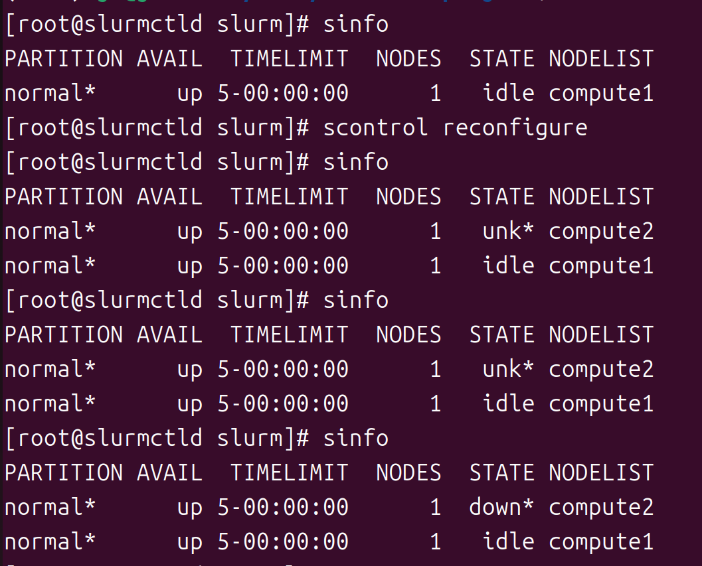

# Scaleout

It is possible to start slurmd as a compute node on another hostmachine on the same LAN and be controlled by slurmctld in this cluster.As a compute node it only needs to be allowed to retain a minimal configuration:

```
FROM rockylinux:9

# Define build arguments
ARG USER=slurm
ARG PUID=990
ARG PGID=990 
ARG GOSU_VERSION=1.17

RUN set -ex \
    && dnf makecache \
    && dnf -y update \
    && dnf -y install dnf-plugins-core epel-release \
    && dnf config-manager --set-enabled crb --set-enabled epel \
    && dnf -y install \
       wget \
       bzip2 \
       perl \
       gcc \
       gcc-c++ \
       git \
       gnupg \
       make \
       munge \
       munge-devel \
       python3-devel \
       python3-pip \
       python3 \
       mariadb-server \
       mariadb-devel \
       psmisc \
       bash-completion \
       vim-enhanced \
       http-parser-devel \
       json-c-devel \
       s-nail libjwt libjwt-devel\
    && dnf clean all \
    && rm -rf /var/cache/dnf

# Install Python packages
RUN pip3 install Cython nose

# Download and install gosu
RUN set -ex \
    && wget -O /usr/local/bin/gosu "https://github.com/tianon/gosu/releases/download/$GOSU_VERSION/gosu-amd64" \
    && wget -O /usr/local/bin/gosu.asc "https://github.com/tianon/gosu/releases/download/$GOSU_VERSION/gosu-amd64.asc" \
    && export GNUPGHOME="$(mktemp -d)" \
    && gpg --batch --keyserver hkps://keys.openpgp.org --recv-keys B42F6819007F00F88E364FD4036A9C25BF357DD4 \
    && gpg --batch --verify /usr/local/bin/gosu.asc /usr/local/bin/gosu \
    && rm -rf "${GNUPGHOME}" /usr/local/bin/gosu.asc \
    && chmod +x /usr/local/bin/gosu \
    && gosu nobody true

COPY slurm /home/software/slurm
WORKDIR /home/software/slurm
# Clone and install Slurm
RUN set -x \
    && ./configure --enable-debug --prefix=/usr --sysconfdir=/etc/slurm \
        --with-mysql_config=/usr/bin  --libdir=/usr/lib64 --with-jwt --enable-slurmrestd --enable-\
    && make install \
    && install -D -m644 etc/cgroup.conf.example /etc/slurm/cgroup.conf.example \
    && install -D -m644 etc/slurm.conf.example /etc/slurm/slurm.conf.example \
    && install -D -m644 etc/slurmdbd.conf.example /etc/slurm/slurmdbd.conf.example \
    && install -D -m644 contribs/slurm_completion_help/slurm_completion.sh /etc/profile.d/slurm_completion.sh \
    && groupadd -r --gid=$PGID $USER \
    && useradd -r -g $USER --uid=$PUID $USER \

    && mkdir /etc/sysconfig/slurm \
        /var/spool/slurmd \
        /var/run/slurmd \
        /var/run/slurmdbd \
        /var/lib/slurmd \
        /var/log/slurm \
        /data \
    && touch /var/lib/slurmd/node_state \
        /var/lib/slurmd/front_end_state \
        /var/lib/slurmd/job_state \
        /var/lib/slurmd/resv_state \
        /var/lib/slurmd/trigger_state \
        /var/lib/slurmd/assoc_mgr_state \
        /var/lib/slurmd/assoc_usage \
        /var/lib/slurmd/qos_usage \
        /var/lib/slurmd/fed_mgr_state \
    && chown -R slurm:slurm /var/*/slurm* \
    #&& /sbin/create-munge-key

RUN groupadd -r -g $RESTGID restd \
 && useradd  -r -u $RESTUID -g restd -G munge -s /sbin/nologin slurmrestd

VOLUME /etc/slurm

# Copy configuration files
COPY conf_files/etc/slurm/slurm.conf /etc/slurm/slurm.conf
COPY conf_files/etc/slurm/slurmdbd.conf /etc/slurm/slurmdbd.conf
COPY conf_files/etc/slurm/cgroup.conf /etc/slurm/cgroup.conf

CMD ["slurmdbd"]
```

1. you need to copy the already configured munge.key to the compute node's /etc/munge/munge.keys. It's possible via the NFS, Lustre, BeeGFS filesystem, Ansible, docker cp, scp...

2. Don't forget chown munge:munge and chmod 400 .

3. Then run this on slurmctld:

```shell 
scontrol reconfigure
```



​	3.1 

​	Execution of munged and slurmd. 

​	3.2 

​	The status UNKNOWN indicates that the connection failed. Even if I take it out of service, it should be DOWN. If you allow it to be ready, it should be 	idle state.

​	This should work regardless of whether the newly added node is in docker or running in hostmachine.

4. I'll give a minimal change to slurm.conf:

SlurmctldHost=slurmctld(192.168.0.55)

SlurmctldPort=16817

NodeName=compute1 RealMemory=3000 State=UNKNOWN 
NodeName=compute2 NodeAddr=192.168.0.174 RealMemory=3000 State=UNKNOWN
PartitionName=normal Default=yes Nodes=compute[1-2] DefMemPerCPU=1000 Shared=NO MaxNodes=3 MaxTime=5-00:00:00 DefaultTime=5-00:00:00 State=UP

